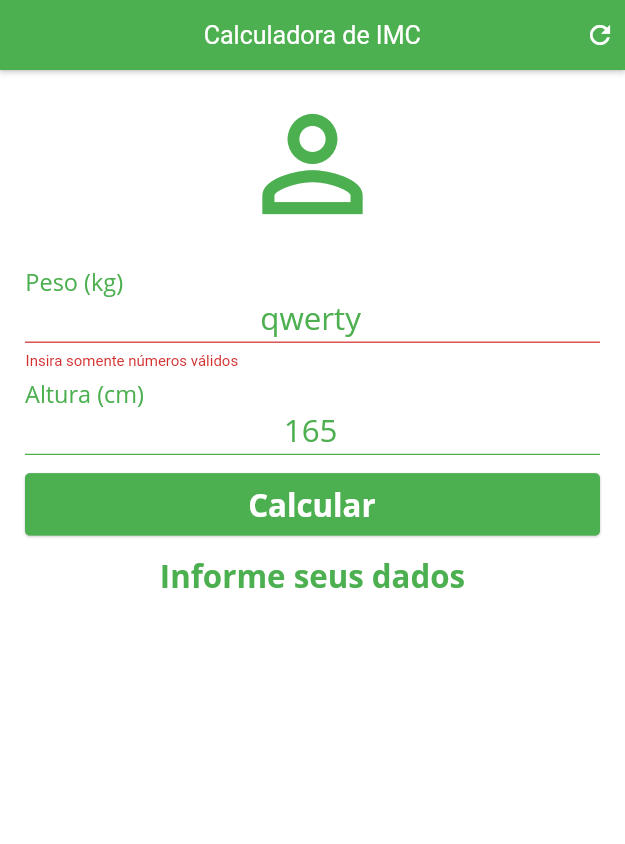

# Calculadora de IMC

Aplicação Mobile de Calculadora de IMC (BMI Calculator) em Flutter desenvolvida durante o treinamento "Criação de Apps Android/iOS/Web com Flutter - 5 cursos em 1" da plataforma Udemy.

## Informações adicionais

- Flutter v. 2.5.1
- Dart v. 2.14.2
- Google Fonts v. 1.0.0

Listar os dispositivos disponíveis
```flutter
  flutter devices
```

Inicializar a aplicação utilizando o Google Chrome
```flutter
  flutter run -d chrome --no-sound-null-safety
```

## Imagens

<div align="center">
  
  
</div>
<div align="center">
  
  
</div>
